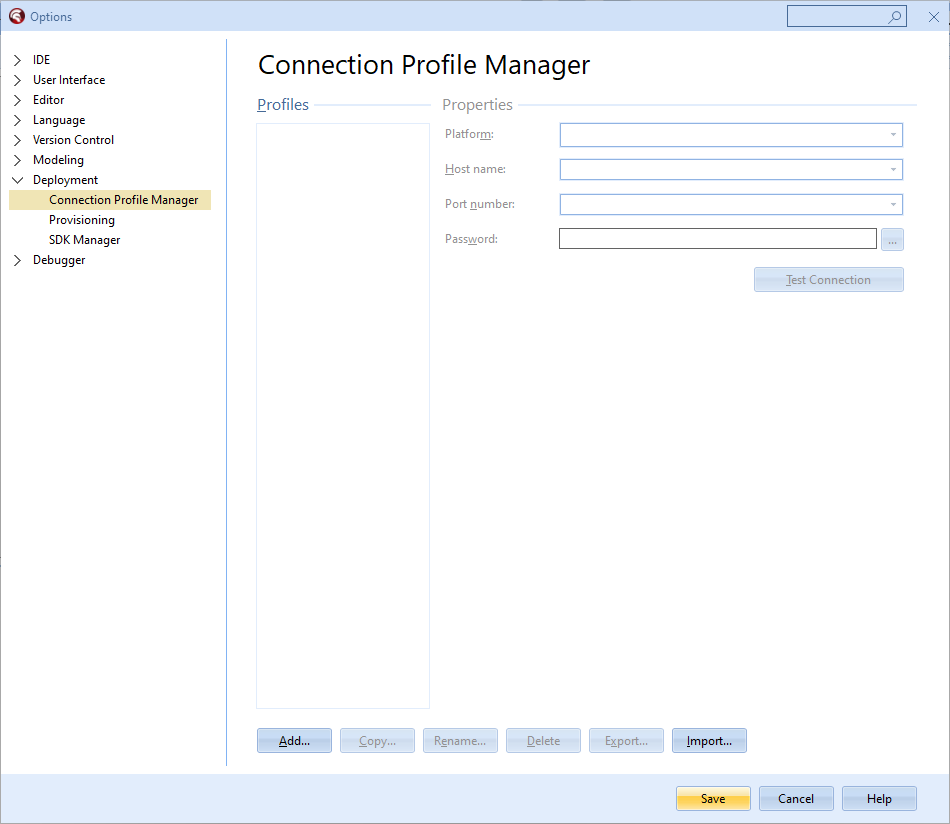
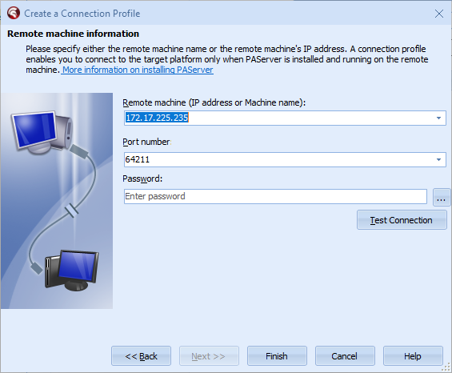
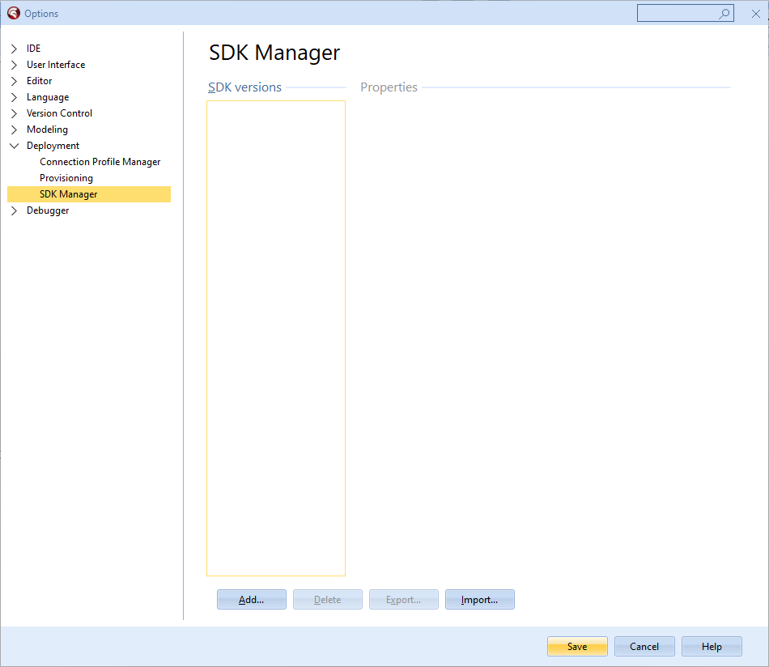
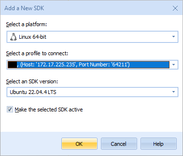
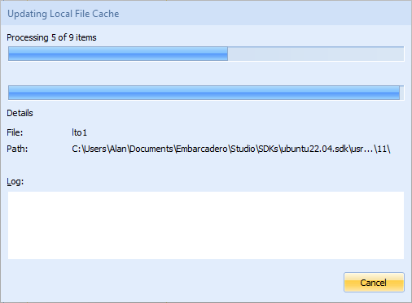
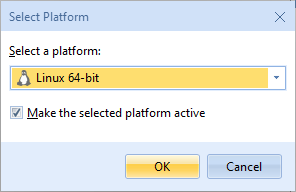

# Running Delphi on WSL2 — when Linux enters your machine and Windows just watches

{{< bruto intro="Back in 2025 I decided to try the crazy idea of running **Delphi on Linux without leaving Windows**.<br>Yep, that thing called **WSL2** — the Windows Subsystem for Linux — letting the penguin move into Windows and eat from the same table.<br><br>And surprisingly, it works. So saddle up, because I’ll show you how I got this running **with Ubuntu 22.04** (the stable one when I wrote this).<br>If you're reading this in the future and the version changed (24.04, 26.04…), **just swap the name during installation and keep moving.**">}}

---

## 1. What the heck is WSL

**WSL** is basically a domesticated Linux running inside Windows.  
It’s not a VM, not Docker — it’s fast and practical.  
You run a command and boom: an Ubuntu appears staring back at you.

---

## 2. Installing Ubuntu (or whichever version is available)

Open **Command Prompt** as administrator and run:

```bash
wsl --list --online
```

You’ll see a list of available distros. I used **Ubuntu 22.04** back then — if 24.04 is out when you read this, use that one.  
The name changes, the process doesn't.

To install:

```bash
wsl --install Ubuntu-22.04
```

Windows will download, install, and ask for a **username and password**.  
Pick something you’ll remember — Linux won’t forgive you if you forget.

---

## 3. Updating the system and installing what matters

Inside Ubuntu, run the basics:

```bash
sudo apt update && sudo apt upgrade && sudo apt dist-upgrade
```

Then install the development tools Delphi needs:

```bash
sudo apt install joe wget p7zip-full curl openssh-server build-essential zlib1g-dev libcurl4-gnutls-dev libncurses5 zlib1g-dev libgtk-3-dev
```

---

## 4. Installing PAServer inside WSL

Copy **PAServer** from Windows into WSL. In Delphi 12, it’s usually located at:

```bash
C:\Program Files (x86)\Embarcadero\Studio\23.0\PAServer\LinuxPAServer23.0.tar.gz
```

Inside Ubuntu:

```bash
cp /mnt/c/Program\ Files\ \(x86\)/Embarcadero/Studio/23.0/PAServer/LinuxPAServer23.0.tar.gz ~/
tar -xvf ./LinuxPAServer23.0.tar.gz
```

Start the server:

```bash
./PAServer-23.0/paserver
```

It will ask for a password — **set a real password**.  
This isn’t “leave everything open” mode. Security matters.

Press `i` and Enter to view the **IP** of the PAServer. Take note.

---

## 5. Configuring Delphi to talk to WSL

In Windows Delphi, install **FMXLinux** through GetIt (if needed).  


Then go to:

```
Tools > Options > Deployment > Connection Profile Manager
```



Click **Add** and create a profile for **Linux 64-bit**.


Enter the IP, username and password defined in Ubuntu, then hit **Test Connection**.




---

## 6. Adding the SDK

Still in Delphi:

```
Tools > Options > Deployment > SDK Manager
```



Click **Add**, select **Linux 64-bit**, and choose the profile you created.



Delphi will copy a mountain of files into WSL. Takes a while — when **Cancel** becomes **Close**, you’re done.



---

## 7. Compiling directly to Linux

Create a **Multi-Device Application** and, in **Project Manager**, select **Linux 64-bit**.  
If it doesn’t show, add it under **Target Platforms**.




Press **F9**. If everything is set up correctly, the app will launch **inside WSL**.


---

## 8. Conclusion


Done. Delphi on Windows, compiling for Linux through WSL.  
Is it pretty? No. Is it practical? Depends. Is it interesting? A lot.

If something fails: check IP, PAServer, SDK and firewall.  
If the problem persists, restart — sometimes Windows just wants attention.

> “If it’s running, don’t touch it. If it stopped, Windows broke it.” — **Delphi Roughneck**



