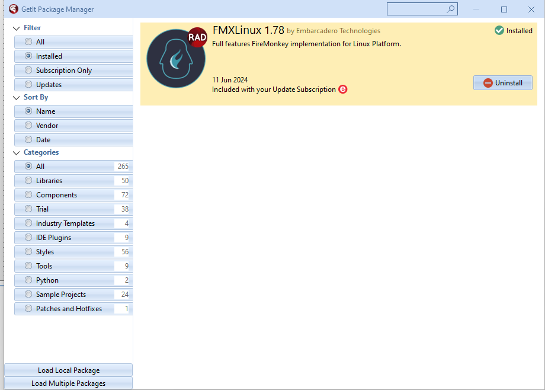
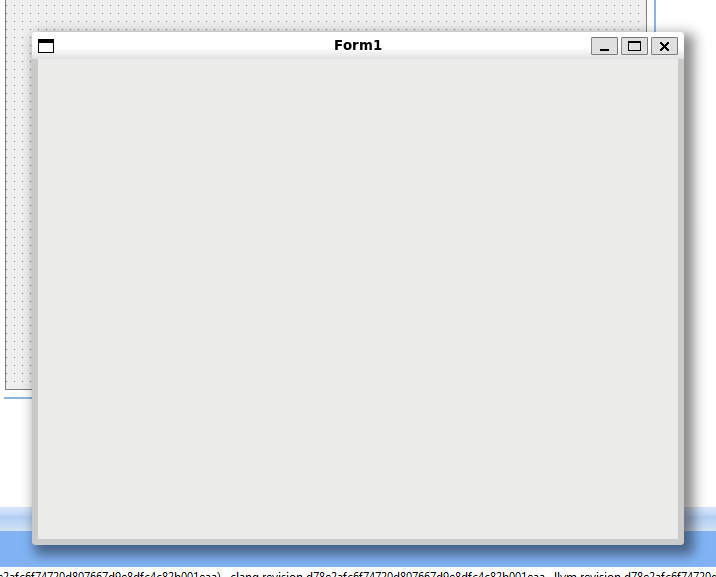

# Rodando Delphi no WSL2 — quando o Linux entra na sua máquina e o Windows só assiste
{{< bruto intro="Lá por 2025 eu resolvi encarar a ideia maluca de rodar **Delphi no Linux sem sair do Windows**.<br>É isso mesmo: um tal de **WSL2** — o “subsystem for linux” — que deixa o pinguim morar dentro do Windows e ainda comer na mesma mesa. <br><br>E pra minha surpresa, funciona. Então se prepara, porque eu vou te mostrar como eu fiz isso funcionar **com o Ubuntu 22.04** (era o estável quando escrevi este post). <br>Se quando você estiver lendo isso o número for outro (24.04, 26.04…), **troca o nome na instalação e segue o baile**.">}}

---
## 1. O que é o tal do WSL
O **WSL** é basicamente um Linux domesticado, rodando dentro do Windows. Não é VM, não é Docker — é rápido e prático.
Você roda um comando e pronto: tem um Ubuntu te olhando feio.

---
## 2. Instalando o Ubuntu (ou o que tiver no lugar dele)
Abra o **Prompt de Comando** como administrador e rode:

```bash
wsl --list --online
```

Vai aparecer uma lista de distribuições. Na época eu usei **Ubuntu 22.04**, mas se já saiu 24.04, use ele. O nome muda, o processo é o mesmo.

Para instalar:

```bash
wsl --install Ubuntu-22.04
```

O Windows baixa, instala e pede **usuário e senha**. Escolha algo que você lembre, porque o Linux vai cobrar.

---
## 3. Atualizando o sistema e instalando o que presta
No Ubuntu, rode o básico para atualizar os pacotes:

```bash
sudo apt update && sudo apt upgrade && sudo apt dist-upgrade
```

Depois instale as ferramentas de desenvolvimento que o Delphi precisa:

```bash
sudo apt install joe wget p7zip-full curl openssh-server build-essential zlib1g-dev libcurl4-gnutls-dev libncurses5 zlib1g-dev libgtk-3-dev
```


---
## 4. Instalando o PAServer no WSL
Copie o **PAServer** do Windows para dentro do WSL. No Delphi 12, o arquivo fica em algo como:

```bash
C:\\Program Files (x86)\\Embarcadero\\Studio\\23.0\\PAServer\\LinuxPAServer23.0.tar.gz
```

No Ubuntu, execute:

```bash
cp /mnt/c/Program\ Files\ \(x86\)/Embarcadero/Studio/23.0/PAServer/LinuxPAServer23.0.tar.gz ~/
tar -xvf ./LinuxPAServer23.0.tar.gz
```

Inicie o servidor:

```bash
./PAServer-23.0/paserver
```

Ele pedirá uma senha — **defina uma senha de verdade**. Aqui não tem ‘deixar tudo aberto’ (laele). Segurança é coisa séria.


Digite `i` e pressione Enter para ver o **IP** do PAServer. Anote.

---
## 5. Configurando o Delphi para conversar com o WSL
No Delphi do Windows, instale o **FMXLinux** via GetIt (se necessário). 


Depois vá em:

```
Tools > Options > Deployment > Connection Profile Manager
```


Clique em **Add** e crie um perfil para **Linux 64-bit**.


Informe o IP do PAServer, usuário e senha definidos no Ubuntu, e **Test Connection**.


---
## 6. Adicionando o SDK
Ainda no Delphi:

```
Tools > Options > Deployment > SDK Manager
```

Clique em **Add**, escolha **Linux 64-bit** e selecione o perfil criado.

O Delphi vai copiar um monte de arquivo para o WSL. Demora — quando o botão **Cancel** virar **Close**, terminou.

---
## 7. Compilando direto para Linux
Crie um projeto **Multi-Device Application** e, no **Project Manager**, selecione **Linux 64-bit**. Se não aparecer, adicione em **Target Platforms**.


Pressione **F9**. Se tudo estiver certo, o app sobe **dentro do WSL**.



---
## 8. Conclusão

Pronto. Delphi no Windows, compilando para Linux no WSL.  
É bonito? Não. É prático? Depende. É curioso? Bastante.

Se der erro: confira IP, PAServer, SDK e firewall. Persistindo, reinicie — às vezes o Windows só quer atenção.

> “Se tá rodando, não mexe. Se parou, o Windows estragou.” — **Bruto do Delphi**


